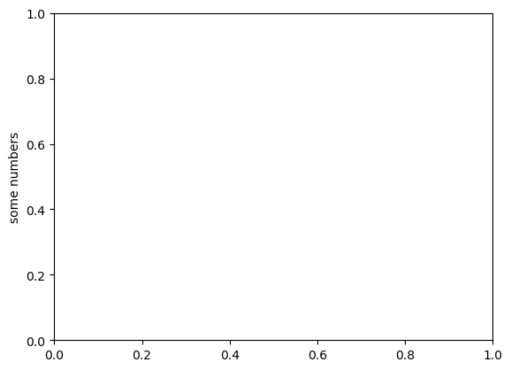
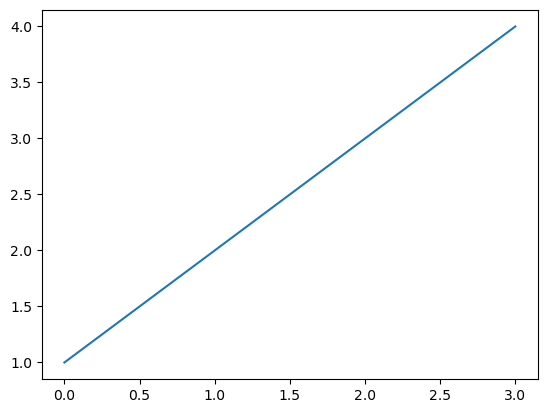
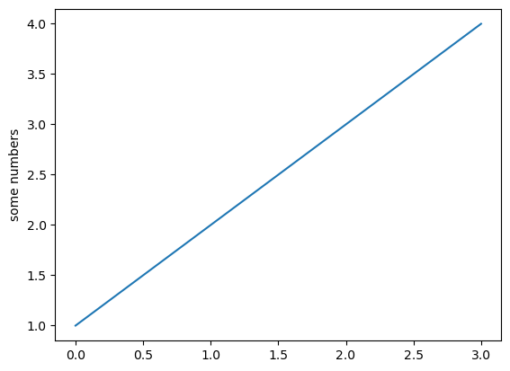
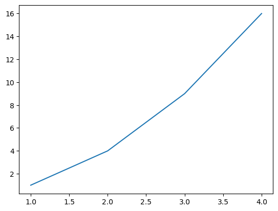
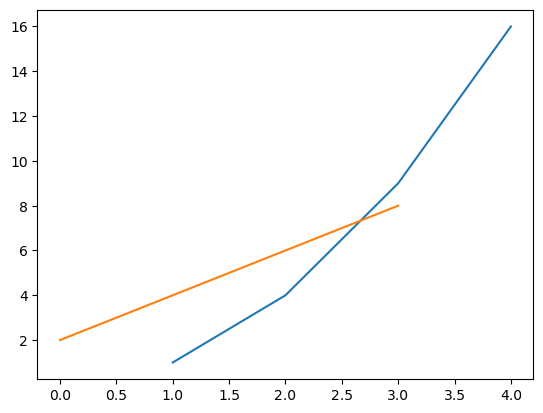
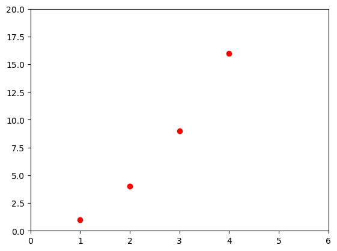
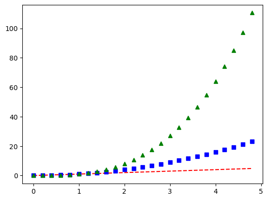
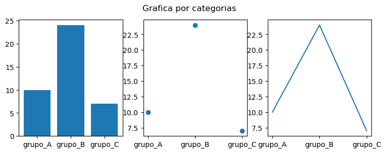

```python
print("Hola semi2")
```

    Hola semi2
    


```python
mensaje=""
```


```python
mensaje=mensaje+"Hola "
```


```python
mensaje=mensaje+"Mundo"
```


```python
print(mensaje)
```

    Hola Mundo
    


```python
import matplotlib.pyplot as plt
```


```python
plt.plot([1, 2, 3, 4])
```


    [<matplotlib.lines.Line2D at 0x21b0ffc69a0>]


    

    


```python
plt.ylabel('some numbers')
```


    Text(0, 0.5, 'some numbers')


    

    


```python
print("hola")
```

    hola
    


```python
print("hola")
```

    hola
    


```python
print("hola")
```

    hola
    


```python
print("hola")
```

    hola
    


```python
print("hola")
```

    hola
    


```python
print("hola")
```

    hola
    


```python
print("hola")
```

    hola
    


```python
print("hola")
```

    hola
    


```python
print("hola")
```

    hola
    


```python
plt.show()
```


```python
x=plt.plot([1, 2, 3, 4])
```


    

    


```python
x.show()
```


    ---------------------------------------------------------------------------

    AttributeError                            Traceback (most recent call last)

    ~\AppData\Local\Temp\ipykernel_21408\938632642.py in <module>
    ----> 1 x.show()
    

    AttributeError: 'list' object has no attribute 'show'


```python
plt.plot([1, 2, 3, 4])
```


    [<matplotlib.lines.Line2D at 0x21b1093b5e0>]


    

    


```python
import matplotlib.pyplot as plt
plt.plot([1, 2, 3, 4])
plt.ylabel('some numbers')
plt.show()
```


    

    


```python
plt.plot([1, 2, 3, 4], [1, 4, 9, 16])
```


    [<matplotlib.lines.Line2D at 0x21b10a38160>]


    

    


```python
plt.plot([1, 2, 3, 4], [1, 4, 9, 16], [2, 4, 6, 8])
```


    [<matplotlib.lines.Line2D at 0x21b10a9f640>,
     <matplotlib.lines.Line2D at 0x21b10a9f6a0>]


    

    


```python
plt.plot([1, 2, 3, 4], [1, 4, 9, 16], 'ro')
plt.axis([0, 6, 0, 20])
plt.show()
```


    

    


```python
import numpy as np
```


```python
t = np.arange(0., 5., 0.2)

plt.plot(t, t, 'r--', t, t**2, 'bs', t, t**3, 'g^')
plt.show()
```


    

    


```python
names = ['grupo_A', 'grupo_B', 'grupo_C']
values = [10, 24, 7]

plt.figure(figsize=(9, 3))

plt.subplot(131)
plt.bar(names, values)
plt.subplot(132)
plt.scatter(names, values)
plt.subplot(133)
plt.plot(names, values)
plt.suptitle('Grafica por categorias')
plt.show()
```


    

    


```python

```
